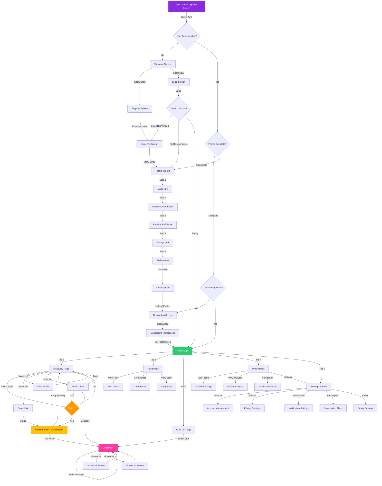

# LGBTinder - User Flow & Sequence Documentation

## 📱 Complete User Journey Flowchart

```
┌─────────────────────────────────────────────────────────────────────────┐
│                         APP LAUNCH (Splash Screen)                      │
└───────────────────────────────┬─────────────────────────────────────────┘
                                │
                                ▼
                    ┌───────────────────────┐
                    │  Check Authentication │
                    │  - Token exists?      │
                    │  - Token valid?       │
                    └───────────┬───────────┘
                                │
                ┌───────────────┴───────────────┐
                │                               │
                ▼                               ▼
        ┌───────────────┐              ┌───────────────┐
        │  Authenticated│              │ Not Authenticated│
        └───────┬───────┘              └───────┬─────────┘
                │                               │
                ▼                               ▼
    ┌───────────────────────┐          ┌──────────────┐
    │ Check Profile Status  │          │ Welcome Screen│
    └───────┬───────────────┘          └──────┬───────┘
            │                                   │
    ┌───────┴───────┐                  ┌───────┴────────┐
    │               │                  │                │
    ▼               ▼                  ▼                ▼
┌─────────┐   ┌──────────┐    ┌──────────┐    ┌──────────┐
│Complete │   │Incomplete│    │  Login   │    │ Register │
└────┬────┘   └────┬─────┘    └────┬─────┘    └────┬─────┘
     │             │               │               │
     │             ▼               │               │
     │    ┌─────────────────┐    │               │
     │    │ Profile Wizard   │    │               │
     │    └────────┬─────────┘    │               │
     │             │               │               │
     │             ▼               │               │
     │    ┌─────────────────┐    │               │
     │    │  Onboarding      │    │               │
     │    └────────┬─────────┘    │               │
     │             │              │               │
     └─────────────┴──────────────┴───────────────┘
                   │              │               │
                   │              │               │
                   ▼              ▼               ▼
            ┌──────────────────────────────────────┐
            │      Email Verification Screen       │
            └──────────────┬──────────────────────┘
                           │
                           ▼
            ┌──────────────────────────────────────┐
            │         Profile Wizard Screen         │
            │  (Basic Info → Identity → Lifestyle)  │
            └──────────────┬──────────────────────┘
                           │
                           ▼
            ┌──────────────────────────────────────┐
            │        Onboarding Screen              │
            │  (App Introduction & Preferences)    │
            └──────────────┬──────────────────────┘
                           │
                           ▼
            ┌──────────────────────────────────────┐
            │          MAIN APP (HomePage)         │
            │  ┌──────────────────────────────┐  │
            │  │  Bottom Navigation (5 Tabs)    │  │
            │  │  1. Discover (Swipe)          │  │
            │  │  2. Feed (Social)            │  │
            │  │  3. Chat (Messages)           │  │
            │  │  4. Profile (Own Profile)     │  │
            │  │  5. Settings                  │  │
            │  └──────────────────────────────┘  │
            └──────────────────────────────────────┘
```

---

## 🔄 Detailed User Flow Sequences

### 1. NEW USER REGISTRATION FLOW

```
Step 1: App Launch
├── Splash Screen (2-3 seconds)
│   ├── Show app logo
│   ├── Check authentication token
│   └── Navigate based on auth status
│
Step 2: Welcome Screen
├── Display app branding
├── "Get Started" button → Register
├── "Login Now" button → Login
└── "Continue as Guest" option (optional)
│
Step 3: Registration Screen
├── Input fields:
│   ├── First Name
│   ├── Last Name
│   ├── Email Address
│   ├── Password
│   └── Confirm Password
├── Terms & Conditions checkbox
├── "Create Account" button
└── Social login options (Google, Apple)
│
Step 4: Email Verification Screen
├── 6-digit code input
├── Auto-advance to next field
├── "Resend Code" button (with countdown)
├── "Verify" button
└── On success → Profile Wizard
│
Step 5: Profile Wizard (5 Steps)
├── Step 1: Basic Information
│   ├── Date of Birth
│   ├── Gender Identity
│   ├── Pronouns
│   └── Location
│
├── Step 2: Identity & Orientation
│   ├── Sexual Orientation
│   ├── Relationship Goals
│   └── Looking For
│
├── Step 3: Physical & Lifestyle
│   ├── Height
│   ├── Body Type
│   ├── Lifestyle choices
│   └── Interests
│
├── Step 4: Background
│   ├── Education
│   ├── Occupation
│   ├── Languages
│   └── Religion (optional)
│
└── Step 5: Preferences
    ├── Age Range Preference
    ├── Distance Preference
    ├── Gender Preferences
    └── "Complete Profile" button
│
Step 6: Photo Upload
├── Upload profile picture (required)
├── Add additional photos (optional, up to 6)
├── Photo editor (crop, filters)
└── "Continue" button
│
Step 7: Onboarding Screen
├── 4-6 intro slides:
│   ├── Slide 1: Welcome & Safety
│   ├── Slide 2: How Matching Works
│   ├── Slide 3: Chat Features
│   ├── Slide 4: Premium Features
│   └── "Get Started" button
│
Step 8: Onboarding Preferences
├── Set initial preferences:
│   ├── Age range
│   ├── Distance
│   ├── Gender preferences
│   └── Relationship goals
└── "Start Matching" → HomePage
```

---

### 2. EXISTING USER LOGIN FLOW

```
Step 1: App Launch
├── Splash Screen
└── Check authentication token
│
Step 2: Welcome Screen (if not authenticated)
├── "Login Now" button
└── Navigate to Login Screen
│
Step 3: Login Screen
├── Email/Phone input
├── Password input
├── "Remember Me" checkbox
├── "Forgot Password?" link
├── "Login" button
└── Social login options
│
Step 4: Authentication Check
├── Validate credentials
├── Check user state:
│   ├── email_verification_required → Email Verification
│   ├── profile_completion_required → Profile Wizard
│   ├── ready_for_app → HomePage
│   └── banned → Show ban message
│
Step 5: Navigate to Appropriate Screen
└── Based on user state
```

---

### 3. MAIN APP NAVIGATION FLOW

```
HomePage (Main Hub)
│
├── Tab 1: DISCOVER (DiscoveryPage)
│   ├── Story Carousel (top)
│   ├── Profile Cards Stack (swipeable)
│   │   ├── Swipe Right → Like
│   │   ├── Swipe Left → Dislike
│   │   ├── Swipe Up → Super Like
│   │   └── Tap Card → Profile Detail
│   ├── Action Buttons:
│   │   ├── Dislike (X)
│   │   ├── Message (if matched)
│   │   ├── Like (Heart)
│   │   └── Super Like (Star)
│   └── Filter Button (top right)
│
├── Tab 2: FEED (FeedPage)
│   ├── Story Carousel (top)
│   ├── Feed Posts (scrollable)
│   │   ├── User posts
│   │   ├── Photos
│   │   ├── Captions
│   │   ├── Like/Comment/Share buttons
│   │   └── Tap → Post Detail
│   └── Create Post Button (FAB)
│
├── Tab 3: CHAT (ChatListPage)
│   ├── Online Friends (horizontal scroll)
│   ├── Messages List (vertical scroll)
│   │   ├── Chat items with:
│   │   │   ├── Avatar
│   │   │   ├── Name
│   │   │   ├── Last message preview
│   │   │   ├── Timestamp
│   │   │   └── Unread badge
│   │   └── Tap → ChatPage
│   ├── Search Bar
│   └── Filter Button
│
├── Tab 4: PROFILE (ProfilePage)
│   ├── Profile Header:
│   │   ├── Avatar (with gradient ring)
│   │   ├── Name
│   │   ├── Designation
│   │   └── Edit Button
│   ├── Statistics Cards:
│   │   ├── Activities
│   │   ├── Likes
│   │   └── Life Moments
│   ├── Menu Items:
│   │   ├── Subscription
│   │   ├── Authentication
│   │   ├── Terms of Use
│   │   └── Wallet
│   └── Settings Button → Settings Screen
│
└── Tab 5: SETTINGS (SettingsScreen)
    ├── Profile Section
    ├── Account Management
    ├── Privacy & Safety
    ├── Notifications
    ├── Premium & Payments
    └── Support
```

---

### 4. DISCOVERY & MATCHING FLOW

```
DiscoveryPage
│
├── View Profile Card
│   ├── Profile photo
│   ├── Name, age, distance
│   ├── Bio preview
│   ├── Badges (zodiac, interests)
│   └── Status indicator (online/offline)
│
├── Actions:
│   ├── Swipe Right / Tap Like → Send Like
│   │   └── If mutual → MATCH! → Match Screen
│   │
│   ├── Swipe Left / Tap Dislike → Pass
│   │
│   ├── Swipe Up / Tap Super Like → Send Super Like
│   │   └── If mutual → MATCH! → Match Screen
│   │
│   └── Tap Card → Profile Detail Screen
│       ├── Full photo gallery
│       ├── Complete bio
│       ├── Interests tags
│       ├── Action buttons:
│       │   ├── Message (if matched)
│       │   ├── Like
│       │   ├── Super Like
│       │   └── Bookmark
│       └── Back → DiscoveryPage
│
└── Filter Button
    ├── Age range
    ├── Distance
    ├── Gender
    ├── Interests
    └── Apply → Refresh cards
```

---

### 5. MATCH FLOW

```
Match Detected (Mutual Like)
│
├── Match Screen
│   ├── Celebration Animation:
│   │   ├── Hearts converge
│   │   ├── Confetti effect
│   │   ├── Haptic feedback
│   │   └── Sound effect
│   ├── Match Percentage Badge (100%)
│   ├── Both profile images (heart frames)
│   ├── "It's a Match!" heading
│   ├── Tagline text
│   └── Action Buttons:
│       ├── "Hai Hello" → ChatPage
│       └── "Swiping Now" → DiscoveryPage
│
└── Navigate to ChatPage
    ├── Pre-filled message: "Hai Hello!"
    └── Start conversation
```

---

### 6. CHAT FLOW

```
ChatListPage
│
├── View Chat List
│   ├── Online friends (top, horizontal)
│   └── Messages list (scrollable)
│
├── Tap Chat Item → ChatPage
│
└── ChatPage
    ├── Chat Header:
    │   ├── Back button
    │   ├── User avatar & name
    │   ├── Online status
    │   └── Menu (3 dots):
    │       ├── View Profile
    │       ├── Block User
    │       ├── Report User
    │       └── Clear Chat
    │
    ├── Messages List:
    │   ├── Sent messages (right, purple)
    │   ├── Received messages (left, gray)
    │   ├── Timestamps
    │   ├── Read receipts
    │   ├── Typing indicator
    │   └── Auto-scroll to bottom
    │
    ├── Message Input:
    │   ├── Text field
    │   ├── Emoji button
    │   ├── Attachment button:
    │   │   ├── Photo/Video
    │   │   ├── Voice message
    │   │   └── Location
    │   └── Send button
    │
    └── Action Buttons (if matched):
        ├── Voice Call → VoiceCallScreen
        └── Video Call → VideoCallScreen
```

---

### 7. PROFILE MANAGEMENT FLOW

```
ProfilePage (Own Profile)
│
├── View Profile
│   ├── Profile header
│   ├── Statistics
│   └── Menu items
│
├── Edit Profile → ProfileEditPage
│   ├── Avatar upload
│   ├── Photo gallery editor
│   ├── Edit fields:
│   │   ├── Name, age, location
│   │   ├── Bio
│   │   ├── Interests
│   │   ├── Preferences
│   │   └── Details
│   └── Save button
│
├── Profile Analytics → ProfileAnalyticsScreen
│   ├── Profile views
│   ├── Match statistics
│   └── Engagement metrics
│
├── Verification → ProfileVerificationScreen
│   ├── Upload ID documents
│   ├── Selfie verification
│   └── Status tracking
│
└── Settings → ComprehensiveSettingsScreen
    ├── Account Management
    ├── Privacy Settings
    ├── Notification Settings
    ├── Subscription Plans
    └── More...
```

---

### 8. SETTINGS FLOW

```
SettingsScreen
│
├── Profile Section
│   ├── Edit Profile
│   ├── Profile Analytics
│   ├── Profile Verification
│   └── Profile Templates
│
├── Account Management
│   ├── Email Change
│   ├── Password Change
│   ├── Two-Factor Auth
│   ├── Active Sessions
│   └── Delete Account
│
├── Privacy & Safety
│   ├── Privacy Settings
│   ├── Safety Center
│   ├── Blocked Users
│   ├── Report History
│   └── Emergency Contacts
│
├── Notifications
│   ├── Notification Settings
│   ├── Group Notifications
│   └── Sound & Vibration
│
├── Premium & Payments
│   ├── Subscription Plans
│   ├── Payment Methods
│   ├── Subscription Management
│   └── Super Like Packs
│
├── App Settings
│   ├── Theme (Dark/Light)
│   ├── Accessibility
│   ├── Language
│   └── Data Usage
│
└── Support
    ├── Help & Support
    ├── Terms of Service
    ├── Privacy Policy
    └── Contact Us
```

---

## 🔄 User Cycle Summary

### Daily Usage Cycle

```
1. OPEN APP
   └── Splash → Check Auth → HomePage

2. DISCOVER PROFILES
   └── DiscoveryPage → Swipe cards → Match → Chat

3. CHECK MESSAGES
   └── ChatListPage → Select chat → ChatPage → Reply

4. VIEW FEED
   └── FeedPage → Scroll posts → Like/Comment

5. MANAGE PROFILE
   └── ProfilePage → Edit/View stats → Settings

6. CLOSE APP
   └── Background → Notifications → Reopen
```

### First-Time User Cycle

```
1. REGISTER
   └── Welcome → Register → Email Verify

2. COMPLETE PROFILE
   └── Profile Wizard (5 steps) → Photo Upload

3. ONBOARDING
   └── Intro slides → Set preferences

4. START MATCHING
   └── DiscoveryPage → Swipe → Match → Chat
```

### Returning User Cycle

```
1. LOGIN
   └── Welcome → Login → HomePage

2. CONTINUE MATCHING
   └── DiscoveryPage → Swipe → Match → Chat

3. MANAGE ACCOUNT
   └── Profile → Settings → Update preferences
```

---

## 📊 Navigation Map

```
SplashPage
│
├── WelcomeScreen
│   ├── LoginScreen
│   │   ├── HomePage (if authenticated)
│   │   ├── EmailVerificationScreen (if needed)
│   │   └── ProfileWizardPage (if incomplete)
│   │
│   └── RegisterScreen
│       └── EmailVerificationScreen
│           └── ProfileWizardPage
│               └── OnboardingScreen
│                   └── OnboardingPreferencesScreen
│                       └── HomePage
│
└── HomePage (Main App)
    │
    ├── DiscoveryPage (Tab 1)
    │   ├── FilterScreen
    │   ├── ProfileDetailScreen
    │   │   └── ChatPage (if matched)
    │   └── MatchScreen
    │       └── ChatPage
    │
    ├── FeedPage (Tab 2)
    │   └── StoryCreationScreen
    │
    ├── ChatListPage (Tab 3)
    │   ├── ChatPage
    │   │   ├── VoiceCallScreen
    │   │   └── VideoCallScreen
    │   └── MessageSearchScreen
    │
    ├── ProfilePage (Tab 4)
    │   ├── ProfileEditPage
    │   ├── ProfileAnalyticsScreen
    │   ├── ProfileVerificationScreen
    │   ├── ProfileTemplatesScreen
    │   ├── ProfileSharingScreen
    │   ├── ProfileExportScreen
    │   ├── ProfileBackupScreen
    │   └── AdvancedProfileCustomizationScreen
    │
    └── SettingsScreen (Tab 5)
        ├── ComprehensiveSettingsScreen
        ├── AccountManagementScreen
        ├── PrivacySettingsScreen
        ├── NotificationSettingsScreen
        ├── SubscriptionPlansScreen
        ├── SafetySettingsScreen
        ├── SafetyCenterScreen
        ├── BlockedUsersScreen
        ├── ReportHistoryScreen
        ├── EmergencyContactsScreen
        ├── TwoFactorAuthScreen
        ├── ActiveSessionsScreen
        ├── PaymentMethodsScreen
        ├── HelpSupportScreen
        └── [More settings screens...]
```

---

## 🎯 Key User Actions & Outcomes

### Primary Actions

1. **Swipe Right (Like)**
   - Action: Like a profile
   - Outcome: If mutual → Match → Chat option
   - If not mutual → Profile added to "Likes Sent"

2. **Swipe Left (Dislike)**
   - Action: Pass on a profile
   - Outcome: Profile removed from stack, won't see again

3. **Swipe Up (Super Like)**
   - Action: Super like a profile
   - Outcome: If mutual → Match → Chat option
   - Shows special indicator to recipient

4. **Tap Profile Card**
   - Action: View full profile
   - Outcome: ProfileDetailScreen with complete info

5. **Send Message**
   - Action: Start/continue conversation
   - Outcome: ChatPage opens, message sent

6. **Match**
   - Action: Mutual like detected
   - Outcome: MatchScreen → Celebration → Chat option

### Secondary Actions

1. **Filter Profiles**
   - Action: Set discovery preferences
   - Outcome: Refreshed profile stack with filters

2. **Edit Profile**
   - Action: Update profile information
   - Outcome: Profile updated, visibility refreshed

3. **View Analytics**
   - Action: Check profile performance
   - Outcome: Statistics displayed

4. **Manage Settings**
   - Action: Configure app preferences
   - Outcome: Settings saved and applied

---

## 🔐 Authentication States

```
UNAUTHENTICATED
├── WelcomeScreen
├── LoginScreen
└── RegisterScreen

AUTHENTICATED (Email Verified)
├── Profile Incomplete
│   └── ProfileWizardPage → OnboardingScreen
│
└── Profile Complete
    ├── Onboarding Incomplete
    │   └── OnboardingScreen
    │
    └── Ready
        └── HomePage (Full Access)
```

---

## 📱 Screen Transitions

### Transition Types

1. **Fade** (180ms linear)
   - Used for: Subtle transitions, modal overlays

2. **Slide** (300ms easeInOut)
   - Used for: Horizontal navigation, page changes

3. **Slide Vertical** (300ms easeInOut)
   - Used for: Bottom sheets, modals

4. **Hero** (400ms easeInOut)
   - Used for: Profile image transitions

5. **Scale** (300ms easeOutBack)
   - Used for: Modal dialogs, popups

6. **Match** (700ms elasticOut)
   - Used for: Match celebration animation

---

## 🎨 User Experience Flow

### Emotional Journey

```
1. EXCITEMENT
   └── App launch, beautiful UI, smooth animations

2. CURIOSITY
   └── Discovery, exploring profiles, learning features

3. ANTICIPATION
   └── Swiping, waiting for matches

4. JOY
   └── Match detected, celebration animation

5. CONNECTION
   └── Chatting, building relationships

6. SATISFACTION
   └── Meaningful conversations, successful matches
```

---

## 📝 Notes for Implementation

1. **State Management**: Use Riverpod for all state
2. **Navigation**: Use go_router for declarative routing
3. **Persistence**: Save user state, preferences, chat history
4. **Real-time**: WebSocket for messages, typing indicators, online status
5. **Offline Support**: Cache profiles, messages, enable offline viewing
6. **Analytics**: Track user actions, screen views, engagement metrics

---

## 🎯 Mermaid.js Flowchart



---

**Last Updated**: December 2024  
**Version**: 1.0  
**Document Type**: User Flow & Sequence Documentation

