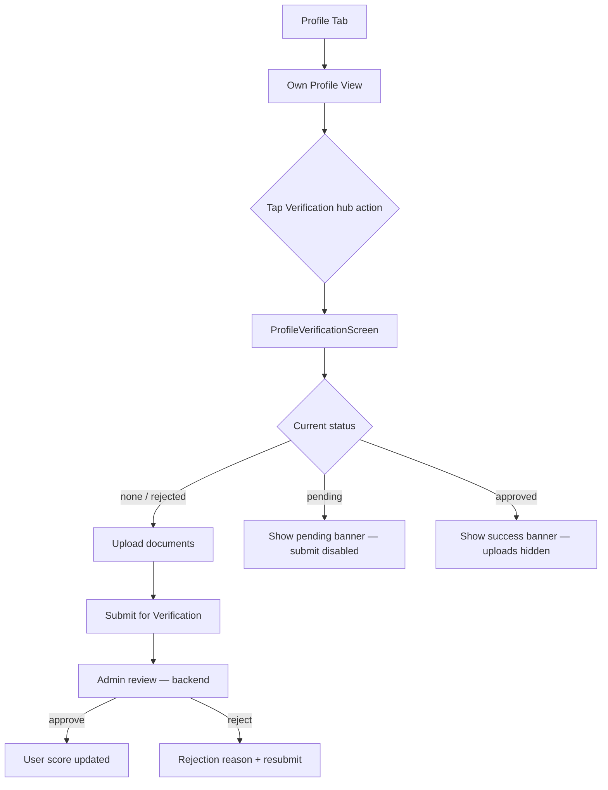
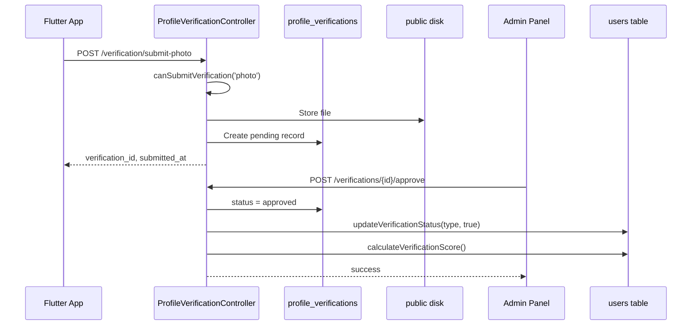

# Profile Verification — Complete Feature Documentation

**Project:** LGBTinder (`lgbtindernew` + `lgbtinder-backend`)  
**Last updated:** July 3, 2026  
**Primary screen:** `lib/screens/profile/profile_verification_screen.dart`

---

## Table of Contents

1. [Executive Summary](#1-executive-summary)
2. [Verification Types in the Platform](#2-verification-types-in-the-platform)
3. [Product Goals & User Benefits](#3-product-goals--user-benefits)
4. [User Flow & Navigation](#4-user-flow--navigation)
5. [Flutter UI Specification](#5-flutter-ui-specification)
6. [Flutter Architecture & Data Layer](#6-flutter-architecture--data-layer)
7. [Backend Architecture](#7-backend-architecture)
8. [API Reference](#8-api-reference)
9. [Database Schema](#9-database-schema)
10. [Verification Scoring & Badges](#10-verification-scoring--badges)
11. [Admin Review Workflow](#11-admin-review-workflow)
12. [Cross-Feature Integration](#12-cross-feature-integration)
13. [Implementation Status Matrix](#13-implementation-status-matrix)
14. [Known Gaps & Mismatches](#14-known-gaps--mismatches)
15. [Recommended Implementation Plan](#15-recommended-implementation-plan)
16. [Testing Checklist](#16-testing-checklist)
17. [File Reference](#17-file-reference)

---

## 1. Executive Summary

Profile Verification is LGBTinder's **identity trust** feature. Users submit proof-of-identity materials (photo, government ID, and/or video) for manual admin review. Approved submissions increase a user's **verification score** (0–100) and unlock tiered badge labels such as "Photo Verified" or "Fully Verified."

| Layer | Status |
|-------|--------|
| **Backend API** | ✅ Fully implemented |
| **Admin review panel** | ✅ Fully implemented (web routes) |
| **Flutter data layer** | ✅ Implemented (service, repository, use case, model, provider) |
| **Flutter UI screen** | ⚠️ Partial — visual shell with mock data and TODO API hooks |
| **End-to-end integration** | ❌ Not connected |

The current Flutter verification page presents an **ID front / ID back / selfie** upload flow, while the backend expects **three independent verification types** (`photo`, `id`, `video`) submitted separately. The profile badge shown across the app (`is_verified`) is tied to **email verification** (`users.is_verify`), not the profile verification score — an important architectural distinction documented below.

---

## 2. Verification Types in the Platform

LGBTinder has **two separate verification systems** that are often conflated in the UI:

### 2.1 Email Verification (Account Activation)

| Aspect | Detail |
|--------|--------|
| **Purpose** | Confirm the user owns their email address during registration/login |
| **User field** | `users.is_verify` (boolean), `users.email_verified_at` |
| **Flutter screen** | `lib/screens/auth/email_verification_screen.dart` |
| **Route** | `/email-verification` (GoRouter) |
| **Backend docs** | `lgbtinder-backend/docs/EMAIL_VERIFICATION_API_DOCUMENTATION.md` |
| **Sets `is_verified` in API** | Yes — `FormatsUserData` maps `is_verify` → `is_verified` |

Email verification is **required for matching**: `MatchingService` and `MatchingController` filter candidates with `where('is_verify', true)`.

### 2.2 Profile Verification (Identity Trust)

| Aspect | Detail |
|--------|--------|
| **Purpose** | Prove the user is a real person via document/media review |
| **User fields** | `photo_verified`, `id_verified`, `video_verified`, `verification_score` |
| **Flutter screen** | `lib/screens/profile/profile_verification_screen.dart` |
| **Route** | No GoRouter route — pushed via `Navigator.push` from profile hub |
| **Backend controller** | `ProfileVerificationController` |
| **Sets `is_verified` in API** | **No** — profile verification score is separate from `is_verify` |

This document focuses on **Profile Verification** (Section 2.2), while noting email verification interactions where relevant.

---

## 3. Product Goals & User Benefits

### 3.1 Why Verify?

The current Flutter screen communicates three value propositions:

1. **Build Trust** — Show others you're a real person
2. **Get More Matches** — Verified profiles get 3x more matches (marketing copy; not enforced in backend logic today)
3. **Safer Community** — Help keep the community safe and authentic

### 3.2 Verification Levels (Backend)

The backend supports a **progressive trust ladder**:

| Type | Weight | Description |
|------|--------|-------------|
| **Photo** | 30 pts | Selfie holding paper with username + today's date |
| **ID** | 40 pts | Government-issued ID upload (passport, driver's license, etc.) |
| **Video** | 30 pts | Short video stating username + specific phrase |

Users can complete one, two, or all three. Each type is reviewed independently.

### 3.3 Badge Labels (Score-Based)

| Score | Badge Label |
|-------|-------------|
| 100 | Fully Verified |
| 70–99 | Highly Verified |
| 40–69 | Verified |
| 30–39 | Photo Verified |
| 0–29 | Unverified |

Returned by `User::getVerificationBadge()` and exposed via `GET /verification/status`.

---

## 4. User Flow & Navigation



### 4.1 Entry Points

| Entry | File | Mechanism |
|-------|------|-----------|
| Profile hub action | `own_profile_view.dart` | `Navigator.push(ProfileVerificationScreen())` |
| Safety section (widget) | `safety_verification_section.dart` | `onVerifyTap` callback (optional) |

### 4.2 Hub Action Display Logic

From `own_profile_view.dart`:

- **Icon:** `AppIcons.verify` (SVG)
- **Title:** "Verification"
- **Subtitle:** `isVerified ? 'Identity confirmed' : 'Build trust faster'`
- **Status chip:** `Verified` (green) or `Pending` (warning)
- **Data source:** `profile.isVerified` from `UserProfile` model

> **Note:** `isVerified` reflects `users.is_verify` (email verification), not profile verification score. Users who completed email verification but not identity verification will show "Verified" in the hub while the verification screen may still prompt for documents.

---

## 5. Flutter UI Specification

**File:** `lib/screens/profile/profile_verification_screen.dart`  
**Widget type:** `ConsumerStatefulWidget` (Riverpod-ready, but does not use providers yet)

### 5.1 Screen Structure

```
AppPageScaffold (title: "Verification", back button)
└── ListView
    ├── Status Banner (conditional)
    │   ├── Approved — green gradient + verified icon
    │   ├── Rejected — red border + rejection reason + resubmit CTA
    │   └── Pending — yellow border + submitted time
    ├── "Why Verify?" section (3 benefit cards)
    ├── "Required Documents" section (hidden when approved)
    │   ├── ID Front upload
    │   ├── ID Back upload
    │   └── Selfie upload
    ├── "Guidelines" section (5 bullet points)
    └── Submit button ("Submit for Verification")
```

### 5.2 State Variables

| Variable | Type | Purpose |
|----------|------|---------|
| `_isLoading` | `bool` | Initial load spinner |
| `_isSubmitting` | `bool` | Submit button loading state |
| `_verificationStatus` | `String` | `'pending'`, `'approved'`, `'rejected'`, `'none'` |
| `_rejectionReason` | `String?` | Admin rejection message |
| `_submittedAt` | `DateTime?` | Submission timestamp |
| `_idFrontUrl` | `String?` | Uploaded ID front preview URL |
| `_idBackUrl` | `String?` | Uploaded ID back preview URL |
| `_selfieUrl` | `String?` | Uploaded selfie preview URL |

### 5.3 Status Banner Behavior

| Status | UI | Submit Enabled |
|--------|-----|----------------|
| `approved` | Green gradient banner, documents hidden | N/A |
| `rejected` | Red banner with reason, "Resubmit Verification" resets state | Yes (after reset) |
| `pending` | Yellow banner with relative time | No |
| `none` | No banner | Yes (when all 3 docs uploaded) |

### 5.4 Document Upload Card

Each document card shows:

- Title + description
- Green border + check icon when uploaded
- `ProfileImageWidget` preview (150px height) when URL present
- `GradientButton` "Upload {title}" when empty

### 5.5 Guidelines (Hardcoded in UI)

- ID must be government-issued
- All text must be clearly visible
- Selfie must show full face and ID clearly
- Documents must be valid and not expired
- Review typically takes 24–48 hours

### 5.6 Design System Compliance

| Element | Current | Target (per project rules) |
|---------|---------|---------------------------|
| Colors | `AppColors.*` theme-aware | ✅ Compliant |
| Typography | `AppTypography.*` | ✅ Compliant |
| Spacing | `AppSpacing.*` | ✅ Compliant |
| Icons | `Icons.*` (Material) | ❌ Should use `AppSvgIcon` / `AppIcons` |
| Scaffold | `AppPageScaffold` | ✅ Compliant |

### 5.7 Related UI Components

| Component | File | Status |
|-----------|------|--------|
| `VerificationBadge` | `widgets/badges/verification_badge.dart` | ✅ Renders purple circle + SVG verify icon |
| `SafetyVerificationSection` | `widgets/profile/safety_verification_section.dart` | ✅ Shows profile/email/phone verification rows |
| `VerificationComponents` | `widgets/verification/verification_components.dart` | ❌ Stub (`// TODO: Implement widget`) |
| Feature-layer screen | `features/profile/presentation/screens/profile_verification_screen.dart` | ❌ Placeholder scaffold only |

### 5.8 Legacy Reference Implementation

`LGBTinder-flutter/lib/screens/profile/profile_verification_screen.dart` (frozen — do not edit) has a more complete **3-tab layout**:

- **Status** — verification result, progress, stats
- **Documents** — per-type document cards
- **Requirements** — guidelines from API

This can serve as a UX reference when rebuilding the `lgbtindernew` screen.

---

## 6. Flutter Architecture & Data Layer

The data layer is **implemented and ready** but **not wired to the UI screen**.

### 6.1 Layer Diagram

```
ProfileVerificationScreen (UI — mock/TODO)
        ↕ (not connected)
ProfileProvider.loadVerificationStatus() / submit*()
        ↕
VerifyProfileUseCase
        ↕
ProfileRepository
        ↕
ProfileService (domain)
        ↕
ApiService → Backend /verification/*
```

### 6.2 API Endpoints (Flutter)

**File:** `lib/core/constants/api_endpoints.dart`

| Constant | Path |
|----------|------|
| `profileVerificationStatus` | `/verification/status` |
| `profileVerificationPhoto` | `/verification/submit-photo` |
| `profileVerificationId` | `/verification/submit-id` |
| `profileVerificationVideo` | `/verification/submit-video` |
| `profileVerificationHistory` | `/verification/history` |
| `profileVerificationCancel(id)` | `/verification/cancel/{id}` |
| `profileVerificationGuidelines` | `/verification/guidelines` |

All routes require `auth:sanctum` bearer token (inside authenticated API group).

### 6.3 Data Model

**File:** `lib/features/profile/data/models/profile_verification.dart`

```dart
class ProfileVerification {
  final bool photoVerified;
  final bool idVerified;
  final bool videoVerified;
  final int verificationScore;
  final int totalVerifications;
  final int pendingVerificationsCount;
  final String verificationBadge;
  final bool canSubmitPhoto;
  final bool canSubmitId;
  final bool canSubmitVideo;
  final List<PendingVerification>? pendingVerifications;
}
```

### 6.4 Provider Methods

**File:** `lib/features/profile/providers/profile_provider.dart`

| Method | Description |
|--------|-------------|
| `loadVerificationStatus()` | Fetches status into `state.verification` |
| `submitPhotoVerification(path)` | Multipart upload |
| `submitIdVerification(path)` | Multipart upload |
| `submitVideoVerification(path)` | Multipart upload |

### 6.5 ProfileService Upload Details

| Endpoint | Form Field | File Types |
|----------|------------|------------|
| `submit-photo` | `photo` | Image (jpeg, png, jpg, webp) |
| `submit-id` | `id_document` | Image or PDF |
| `submit-video` | `video` | mp4, mov, avi |

Uses Dio `FormData` + `MultipartFile.fromFile`.

---

## 7. Backend Architecture

### 7.1 Components

| Component | Path |
|-----------|------|
| User API controller | `app/Http/Controllers/Api/ProfileVerificationController.php` |
| Admin controller | `app/Http/Controllers/Api/Admin/VerificationManagementController.php` |
| Model | `app/Models/ProfileVerification.php` |
| User helpers | `app/Models/User.php` (verification methods) |
| Migration | `database/migrations/2024_01_01_000000_create_profile_verifications_table.php` |
| Routes (user) | `routes/api.php` → `verification/*` |
| Routes (admin) | `routes/web.php` → `verifications/*` |

### 7.2 Request Lifecycle



### 7.3 Business Rules

1. **One pending submission per type** — `canSubmitVerification()` returns false if already verified or pending for that type
2. **Independent review** — photo, id, and video are separate records
3. **Approval updates user flags** — `photo_verified`, `id_verified`, or `video_verified` set to true with timestamp
4. **Rejection does not revoke** prior approved types
5. **Cancel** — user can delete pending submissions (file + DB record)
6. **Caching** — status/history cached 5 min; guidelines cached 24 hr
7. **Rate limiting** — submit endpoints use `throttle:uploads` middleware (~10/min)

### 7.4 File Storage

- **Disk:** `public`
- **Path pattern:** `verifications/{user_id}/{type}_{timestamp}.{ext}`
- **URL:** via `cdn_url($file_path, 'public')` on model accessor

---

## 8. API Reference

**Base URL:** `{API_HOST}/api`  
**Auth:** `Authorization: Bearer {sanctum_token}`

### 8.1 GET `/verification/status`

Returns current verification state for the authenticated user.

**Response 200:**
```json
{
  "status": "success",
  "data": {
    "verification_status": {
      "photo_verified": false,
      "id_verified": false,
      "video_verified": false,
      "verification_score": 0,
      "total_verifications": 0,
      "pending_verifications": 1
    },
    "verification_badge": "Unverified",
    "can_submit_photo": true,
    "can_submit_id": true,
    "can_submit_video": true,
    "pending_verifications": [
      {
        "id": 42,
        "type": "photo",
        "status": "pending",
        "submitted_at": "2026-07-01T10:30:00.000000Z"
      }
    ]
  }
}
```

### 8.2 GET `/verification/guidelines`

Returns static requirements for each verification type (cached 24 hours).

**Response 200:**
```json
{
  "status": "success",
  "data": {
    "photo_verification": {
      "description": "Take a clear photo of yourself holding a piece of paper with your username and today's date",
      "requirements": ["Photo must be clear and well-lit", "..."]
    },
    "id_verification": {
      "description": "Upload a photo of your government-issued ID",
      "requirements": ["..."],
      "privacy_note": "Your ID information is encrypted..."
    },
    "video_verification": {
      "description": "Record a short video saying your username and a specific phrase",
      "requirements": ["..."]
    }
  }
}
```

### 8.3 GET `/verification/history`

Returns all verification submissions for the user.

**Response 200:**
```json
{
  "status": "success",
  "data": {
    "verifications": [
      {
        "id": 42,
        "type": "photo",
        "type_label": "Photo Verification",
        "status": "rejected",
        "status_label": "Rejected",
        "submitted_at": "2026-07-01T10:30:00.000000Z",
        "reviewed_at": "2026-07-02T08:00:00.000000Z",
        "admin_notes": "Photo was too blurry",
        "reviewer_name": "Admin User"
      }
    ]
  }
}
```

### 8.4 POST `/verification/submit-photo`

**Content-Type:** `multipart/form-data`

| Field | Rules |
|-------|-------|
| `photo` | required, image, jpeg/png/jpg/webp, max 10 MB |

**Success 200:**
```json
{
  "status": "success",
  "message": "Photo verification submitted successfully",
  "data": {
    "verification_id": 42,
    "submitted_at": "2026-07-01T10:30:00.000000Z"
  }
}
```

**Error 400:** Already submitted or approved  
**Error 422:** Validation failed

### 8.5 POST `/verification/submit-id`

| Field | Rules |
|-------|-------|
| `id_document` | required, file, jpeg/png/jpg/pdf, max 10 MB |

### 8.6 POST `/verification/submit-video`

| Field | Rules |
|-------|-------|
| `video` | required, file, mp4/mov/avi, max 50 MB |

### 8.7 DELETE `/verification/cancel/{verificationId}`

Cancels a **pending** verification. Deletes stored file and DB record.

**Error 404:** Not found or not pending

---

## 9. Database Schema

### 9.1 `profile_verifications` Table

| Column | Type | Description |
|--------|------|-------------|
| `id` | bigint | Primary key |
| `user_id` | FK → users | Owner |
| `type` | enum: `photo`, `id`, `video` | Verification type |
| `status` | enum: `pending`, `approved`, `rejected` | Review state |
| `file_path` | string | Storage path |
| `file_type` | string | MIME type |
| `file_size` | integer | Bytes |
| `admin_notes` | text | Reviewer notes / rejection reason |
| `submitted_at` | timestamp | Submission time |
| `reviewed_at` | timestamp | Review completion time |
| `reviewed_by` | FK → admins | Reviewing admin |
| `created_at`, `updated_at` | timestamps | — |

**Indexes:** `(user_id, type)`, `(status, type)`

### 9.2 `users` Table (Verification Columns)

| Column | Type | Default | Description |
|--------|------|---------|-------------|
| `is_verify` | boolean | false | **Email** verification (separate system) |
| `photo_verified` | boolean | false | Photo identity verification approved |
| `id_verified` | boolean | false | ID verification approved |
| `video_verified` | boolean | false | Video verification approved |
| `photo_verified_at` | timestamp | null | Approval timestamp |
| `id_verified_at` | timestamp | null | Approval timestamp |
| `video_verified_at` | timestamp | null | Approval timestamp |
| `verification_score` | integer | 0 | 0–100 composite score |

---

## 10. Verification Scoring & Badges

### 10.1 Score Calculation

```php
// User::calculateVerificationScore()
$score = 0;
if ($this->photo_verified) $score += 30;
if ($this->id_verified)   $score += 40;
if ($this->video_verified) $score += 30;
// Max: 100
```

### 10.2 Badge Mapping

```php
// User::getVerificationBadge()
score >= 100 → 'Fully Verified'
score >= 70  → 'Highly Verified'
score >= 40  → 'Verified'
score >= 30  → 'Photo Verified'
else         → 'Unverified'
```

### 10.3 Approval Side Effects

When admin approves via `ProfileVerification::approve()`:

1. Record status → `approved`, `reviewed_at`, `reviewed_by`, `admin_notes`
2. `user->updateVerificationStatus($type, true)` — sets `{type}_verified` + timestamp
3. `user->calculateVerificationScore()` — recalculates score

> **Important:** `is_verify` is **not** updated by profile verification approval. Email and identity verification remain decoupled.

---

## 11. Admin Review Workflow

Admin routes are in `routes/web.php` under `verifications/*` with `user_admin` middleware.

| Method | Route | Action |
|--------|-------|--------|
| GET | `/verifications` | List verifications (filter by type, status; paginated) |
| GET | `/verifications/statistics` | Overview counts + recent submissions |
| GET | `/verifications/{id}` | Full detail incl. file URL + user verification status |
| POST | `/verifications/{id}/approve` | Approve (optional `notes`) |
| POST | `/verifications/{id}/reject` | Reject (required `notes`) |
| POST | `/verifications/bulk-approve` | Bulk approve pending IDs |
| POST | `/verifications/bulk-reject` | Bulk reject with shared notes |

### 11.1 Admin Detail Response Includes

- Verification file URL (CDN)
- User profile image, email, registration date
- User's full `getVerificationStatus()` summary
- Reviewer name (if previously reviewed)

---

## 12. Cross-Feature Integration

### 12.1 Where Verification Appears

| Feature | Field Used | Meaning |
|---------|------------|---------|
| Discovery / matching | `is_verify` | Email-verified users only in match pool |
| Profile cards / detail sheet | `is_verified` | From `is_verify` — shows verify badge |
| Own profile hero | `isVerified` | From `is_verify` |
| Video calls | `require_verified_badge` setting | Blocks unverified (`is_verify`) callers |
| Profile hub | `isVerified` | Drives hub status chip text/color |

### 12.2 Profile Verification Score — Not Yet Surfaced

`verification_score`, `verification_badge`, and per-type flags (`photo_verified`, etc.) are **not exposed** in standard profile/discovery API responses today. Only available via `GET /verification/status`.

---

## 13. Implementation Status Matrix

| Item | Backend | Flutter Data | Flutter UI |
|------|---------|--------------|------------|
| Get verification status | ✅ | ✅ | ❌ TODO mock |
| Submit photo | ✅ | ✅ | ❌ |
| Submit ID | ✅ | ✅ | ❌ (UI has front/back split) |
| Submit video | ✅ | ✅ | ❌ |
| Get guidelines | ✅ | ✅ | ❌ hardcoded |
| Get history | ✅ | ⚠️ parser mismatch | ❌ |
| Cancel pending | ✅ | ✅ | ❌ |
| Admin approve/reject | ✅ | N/A | N/A |
| Verification badge widget | N/A | ✅ | ✅ used on profiles |
| Safety section widget | N/A | ✅ | ✅ |
| GoRouter route | N/A | N/A | ❌ Navigator.push only |
| Image picker integration | N/A | N/A | ❌ stub snackbar |
| SVG icons on screen | N/A | N/A | ❌ uses Material Icons |
| E2E tests | ❌ | ❌ | ❌ |

---

## 14. Known Gaps & Mismatches

### 14.1 UI vs Backend Document Model

| Flutter UI (current) | Backend API |
|------------------------|-------------|
| ID Front + ID Back + Selfie (single submit) | Separate `photo`, `id`, `video` submissions |
| One combined `_verificationStatus` | Per-type status + aggregate score |
| `POST /api/profile/verification/submit` (TODO comment) | Three endpoints: `submit-photo`, `submit-id`, `submit-video` |

**Recommendation:** Redesign UI to match backend's 3-type model (align with legacy `LGBTinder-flutter` tabbed approach or a stepper UI).

### 14.2 `is_verified` vs Profile Verification

- Profile hub shows "Verified" when `is_verify` is true (email)
- Verification screen is for identity documents
- Users may see conflicting states: hub says "Verified" but screen asks for documents

**Recommendation:** Use `verification_score` / `verification_badge` for hub status, or split labels: "Email Verified" vs "Identity Verified".

### 14.3 Flutter History Parser Bug

`ProfileService.getVerificationHistory()` reads `response.data!['history']` but backend returns `data.verifications`.

### 14.4 Flutter Model — Pending List Key

Backend returns pending items in `data.pending_verifications` (array).  
Flutter model looks for `pending_verifications_list` and count in `verification_status.pending_verifications` (integer). The array items should be mapped from the top-level `pending_verifications` key.

### 14.5 Submit Response Parsing

Submit endpoints return `{ verification_id, submitted_at }` — not a full `ProfileVerification` object. `ProfileService.submit*()` tries `ProfileVerification.fromJson(response.data!)` which will produce incomplete/partial state. Should re-fetch status after submit.

### 14.6 No Profile Verification → `is_verify` Link

Approving identity verification does not set `is_verify`. If product intent is that identity verification unlocks matching visibility, additional backend logic is needed.

### 14.7 `VerificationComponents` Widget

Placeholder only — no reusable status/progress/history cards in `lgbtindernew`.

---

## 15. Recommended Implementation Plan

### Phase 1 — Wire Existing Screen to API (MVP)

1. Replace mock `_loadVerificationStatus()` with `ref.read(profileProvider.notifier).loadVerificationStatus()`
2. Map `ProfileVerification` state to UI (per-type cards instead of front/back/selfie)
3. Integrate `image_picker` for photo/ID; consider `file_picker` for video
4. Call `submitPhotoVerification`, `submitIdVerification`, `submitVideoVerification` per type
5. Fetch guidelines from API instead of hardcoding
6. Fix history parser and pending list mapping
7. Re-fetch status after each submit

### Phase 2 — UX Alignment

1. Adopt 3-tab or stepper layout (Status / Submit / History) per legacy reference
2. Replace Material Icons with `AppSvgIcon`
3. Add `VerificationComponents` widgets: status card, progress ring, history list
4. Show per-type pending/approved/rejected with cancel action
5. Add GoRouter route: `/profile/verification`

### Phase 3 — Product Consistency

1. Expose `verification_badge` and `verification_score` in profile API responses
2. Update `VerificationBadge` to support tiered badges (photo / highly / fully)
3. Clarify hub copy: separate email vs identity verification status
4. Decide if `is_verify` should require identity verification for matching
5. Add analytics events: `verification_started`, `verification_submitted`, `verification_approved_view`

### Phase 4 — Quality

1. Widget tests for all status states (light/dark)
2. Integration tests with mocked multipart uploads
3. E2E: profile → verification → submit photo flow
4. Accessibility: semantic labels, 48dp touch targets on upload buttons

---

## 16. Testing Checklist

### 16.1 Manual QA

- [ ] Unverified user sees upload options for all eligible types
- [ ] Submit photo → status shows pending, submit disabled for that type
- [ ] Cancel pending → can resubmit
- [ ] Admin approve → score updates, badge label changes
- [ ] Admin reject → rejection reason visible, resubmit enabled
- [ ] Already verified type → cannot resubmit (400 from API)
- [ ] Rate limit → graceful error after 10 rapid uploads
- [ ] Dark mode rendering for all banners and cards
- [ ] Large images rejected (>10 MB photo, >50 MB video)

### 16.2 API Tests (Suggested)

```bash
# Get status
curl -H "Authorization: Bearer $TOKEN" \
  https://api.example.com/api/verification/status

# Submit photo
curl -X POST -H "Authorization: Bearer $TOKEN" \
  -F "photo=@selfie.jpg" \
  https://api.example.com/api/verification/submit-photo
```

---

## 17. File Reference

### Flutter (`lgbtindernew`)

| File | Role |
|------|------|
| `lib/screens/profile/profile_verification_screen.dart` | **Main UI screen** |
| `lib/features/profile/data/models/profile_verification.dart` | Data models |
| `lib/features/profile/domain/use_cases/verify_profile_use_case.dart` | Use case |
| `lib/features/profile/domain/services/profile_service.dart` | API calls |
| `lib/features/profile/data/repositories/profile_repository.dart` | Repository |
| `lib/features/profile/providers/profile_provider.dart` | Riverpod state |
| `lib/core/constants/api_endpoints.dart` | Endpoint constants |
| `lib/widgets/badges/verification_badge.dart` | Profile badge widget |
| `lib/widgets/profile/safety_verification_section.dart` | Safety settings section |
| `lib/widgets/verification/verification_components.dart` | Stub components |
| `lib/features/profile/presentation/widgets/own_profile/own_profile_view.dart` | Navigation entry |

### Backend (`lgbtinder-backend`)

| File | Role |
|------|------|
| `app/Http/Controllers/Api/ProfileVerificationController.php` | User API |
| `app/Http/Controllers/Api/Admin/VerificationManagementController.php` | Admin API |
| `app/Models/ProfileVerification.php` | Eloquent model |
| `app/Models/User.php` | Score/badge helpers |
| `routes/api.php` (lines ~691–708) | User routes |
| `routes/web.php` (lines ~445–454) | Admin routes |
| `database/migrations/2024_01_01_000000_create_profile_verifications_table.php` | Schema |

### Related Documentation

| File | Topic |
|------|-------|
| `lgbtinder-backend/docs/EMAIL_VERIFICATION_API_DOCUMENTATION.md` | Email verification (separate system) |
| `lgbtindernew/docs/USER_PAGE_FLOW_TASK_LIST.md` | Auth/verification flow tasks |
| `lgbtindernew/docs/E2E_TEST_PLAN.md` | Email verification E2E scope |

---

## Appendix A — UI Screen State Machine

```
                    ┌─────────┐
                    │  none   │
                    └────┬────┘
                         │ upload all docs + submit
                         ▼
                    ┌─────────┐
              ┌────│ pending │────┐
              │    └─────────┘    │
     admin reject              admin approve
              │                    │
              ▼                    ▼
        ┌──────────┐         ┌──────────┐
        │ rejected │         │ approved │
        └────┬─────┘         └──────────┘
             │ resubmit
             ▼
        ┌─────────┐
        │  none   │
        └─────────┘
```

> **Note:** This state machine reflects the **current Flutter UI** (single aggregate status). The **backend** uses independent per-type state machines.

---

## Appendix B — Suggested Target UI (Aligned with Backend)

```
Verification Screen
├── Header: verification_badge + score (e.g. "Highly Verified · 70/100")
├── Progress: 3-segment bar (Photo 30 | ID 40 | Video 30)
├── Photo Verification Card
│   ├── Status chip (not started / pending / approved / rejected)
│   ├── Guidelines excerpt
│   └── Upload / Cancel / View actions
├── ID Verification Card
│   └── (same pattern)
├── Video Verification Card
│   └── (same pattern)
└── History Section (collapsible list from /verification/history)
```

This layout maps 1:1 to backend capabilities and eliminates the front/back/selfie mismatch.

---

*End of document.*
