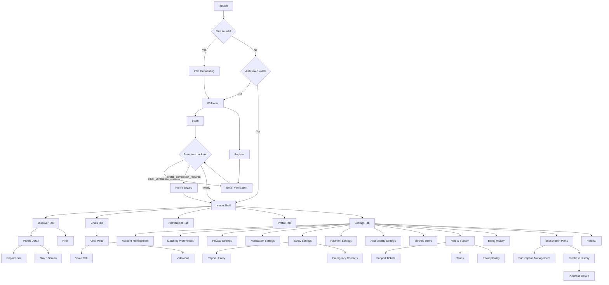

# LGBTinder User Page Flow Canvas

## 1) Complete page inventory (what exists in codebase)

This inventory is split into:
- **Active user flow pages** (reachable from router/tabs/navigation)
- **Existing but not in current primary flow** (legacy, duplicate, admin, experiments)

### A. Active user flow pages (current product path)

#### Core app pages (`*page.dart`)
- `lib/pages/splash_page.dart`
- `lib/pages/onboarding_page.dart`
- `lib/pages/home_page.dart`
- `lib/pages/discovery_page.dart`
- `lib/pages/chat_list_page.dart`
- `lib/pages/chat_page.dart`
- `lib/pages/profile_page.dart`
- `lib/pages/profile_edit_page.dart`
- `lib/pages/profile_wizard_page.dart`

#### Auth + account screens
- `lib/screens/auth/welcome_screen.dart`
- `lib/screens/auth/login_screen.dart`
- `lib/screens/auth/register_screen.dart`
- `lib/screens/auth/email_verification_screen.dart`
- `lib/screens/auth/forgot_password_screen.dart`

#### Discovery / matching / messaging / calls
- `lib/screens/discovery/profile_detail_screen.dart`
- `lib/screens/discovery/filter_screen.dart`
- `lib/features/matching/presentation/screens/matches_screen.dart`
- `lib/widgets/match/match_screen.dart`
- `lib/screens/voice_call_screen.dart`
- `lib/screens/video_call_screen.dart`

#### Settings / support / legal / safety
- `lib/screens/settings_screen.dart`
- `lib/screens/settings/account_management_screen.dart`
- `lib/features/settings/presentation/screens/matching_preferences_screen.dart`
- `lib/screens/privacy_settings_screen.dart`
- `lib/screens/notification_settings_screen.dart`
- `lib/screens/safety_settings_screen.dart`
- `lib/screens/payment_settings_screen.dart`
- `lib/screens/accessibility_settings_screen.dart`
- `lib/screens/help_support_screen.dart`
- `lib/screens/support_tickets_screen.dart`
- `lib/screens/blocked_users_screen.dart`
- `lib/features/safety/presentation/screens/report_user_screen.dart`
- `lib/screens/report_history_screen.dart`
- `lib/screens/emergency_contacts_screen.dart`
- `lib/screens/legal/terms_of_service_screen.dart`
- `lib/screens/legal/privacy_policy_screen.dart`

#### Notifications / payments / growth
- `lib/features/notifications/presentation/screens/notifications_screen.dart`
- `lib/screens/billing_history_screen.dart`
- `lib/features/payments/presentation/screens/subscription_plans_screen.dart`
- `lib/features/payments/presentation/screens/subscription_management_screen.dart`
- `lib/features/payments/presentation/screens/google_play_billing_test_screen.dart`
- `lib/features/payments/presentation/screens/google_play_purchase_history_screen.dart`
- `lib/features/payments/presentation/screens/purchase_details_screen.dart`
- `lib/features/marketing/presentation/screens/referral_screen.dart`

### B. Existing pages/screens not in current primary user flow

#### Page files
- `lib/pages/search_page.dart`
- `lib/pages/api_test_page.dart`
- `lib/features/onboarding/presentation/widgets/onboarding_page.dart`
- `lib/widgets/splash/simple_splash_page.dart`
- `lib/widgets/splash/optimized_splash_page.dart`

#### Screen files (non-primary / duplicate / admin / tools)
- `lib/screens/subscription_plans_screen.dart` (duplicate)
- `lib/screens/subscription_management_screen.dart` (duplicate)
- `lib/screens/premium/premium_subscription_screen.dart` (duplicate path)
- `lib/features/payments/presentation/screens/premium_subscription_screen.dart`
- `lib/screens/onboarding/onboarding_screen.dart` (duplicate path)
- `lib/features/onboarding/presentation/screens/onboarding_screen.dart` (duplicate path)
- `lib/screens/onboarding/enhanced_onboarding_screen.dart`
- `lib/features/admin/presentation/screens/admin_dashboard_screen.dart`
- `lib/features/analytics/presentation/screens/analytics_screen.dart`
- `lib/screens/discovery/search_screen.dart`
- `lib/screens/discovery/likes_received_screen.dart`
- `lib/screens/safety_center_screen.dart`
- `lib/screens/community_forum_screen.dart`
- `lib/screens/call_history_screen.dart`
- `lib/screens/message_search_screen.dart`
- `lib/features/marketing/presentation/screens/enhanced_plans_screen.dart`
- `lib/features/marketing/presentation/screens/daily_rewards_screen.dart`
- `lib/features/marketing/presentation/screens/badges_screen.dart`
- `lib/features/auth/presentation/screens/*.dart` (parallel auth implementation)
- `lib/screens/profile/*.dart` (advanced profile utilities, currently not in main flow)

---

## 2) Canvas: end-to-end user page flow

---

## 3) Auth protection policy (recommended)

### Public pages (no auth required)
- `Splash`
- `Welcome`
- `Login`
- `Register`
- `EmailVerification`
- `ForgotPassword`
- `Terms`
- `PrivacyPolicy`

### Auth-required pages (must redirect to welcome/login if not authenticated)
- `Home` + all tabs
- `Discover`, `ChatList`, `Chat`, `Notifications`, `Profile`, `Settings`
- `ProfileWizard` (only after auth pre-registration token or login token)
- `ProfileEdit`, `ProfileDetail`
- `Matches`, `BlockedUsers`
- `BillingHistory`, `SubscriptionPlans`, `SubscriptionManagement`
- `Referral`
- Safety and account settings pages

### Strongly recommended route guards
- Global guard for all protected routes in `GoRouter.redirect`
- Route-level exception list for public paths only
- Handle deep links by:
  - storing intended destination if unauthenticated
  - redirecting to auth
  - resuming destination post-login

---

## 4) Role visibility policy (Basid / Silder / Golden)

The codebase currently uses plan naming around `Basic/Premium/Golden` and product ids `bronze_base/silver_base/gold_base`.  
For your requested roles, map as:
- **basid** -> Basic (bronze-level)
- **silder** -> Silver/Premium-level
- **golden** -> Golden-level

### Shared for all roles (`basid`, `silder`, `golden`)
- Core social flow: discovery, profile viewing, chat list, messaging baseline
- Account/settings/help/legal pages
- Profile edit and onboarding completion

### `silder` and `golden` only
- Advanced filters
- Boosted discovery features
- Enhanced match analytics
- Extended chat/search convenience features

### `golden` only
- Full premium bundles (all boosts/super-likes/priority placement)
- Exclusive badges/themes/marketing perks
- Highest limits for discovery and interaction actions

---

## 5) Missing pages / missing flow links (gap analysis)

### Missing or broken route targets (referenced but not declared in router)
- `/help`
- `/discover` (router uses `/home/discovery`)
- `/profile/:id` style paths (router expects query-based profile route)
- `/chat/:id` style paths (router expects query-based chat route)
- multiple marketing/deep-link paths (`/likes`, `/matches/:id`, `/marketing/...`, `/plans`, etc.)

### Product-level pages likely missing (for complete UX)
- `RoleUpgradeComparisonPage` (clear feature comparison between basid/silder/golden)
- `PostLoginIntentResolverPage` (resume deep-link destination after auth)
- `FeatureLockedPage` (upsell when user hits restricted capability)
- `SubscriptionStatusPage` (single source of truth for active plan and benefits)
- `EmptyStateJourneyPages` for no matches/no chats/no notifications

